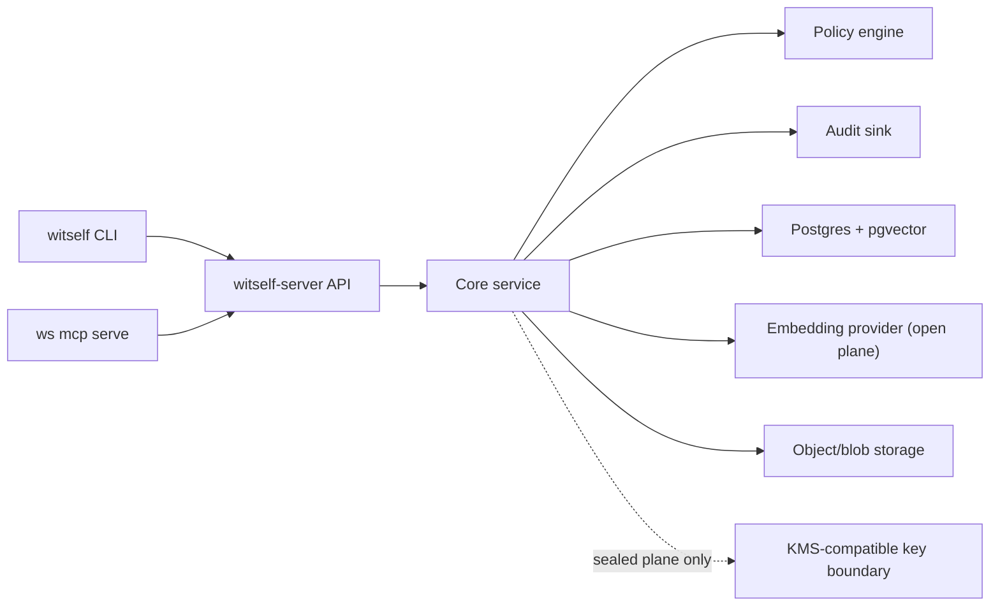

# Witself Self-Hosting

Status: draft. This document describes the intended self-hosted Witself backend
experience before implementation.

## Positioning

Self-hosting should let an operator run the Witself backend API in their own
cloud while using the same public CLI, MCP tools, identity references, JSON
contracts, and agent token model as managed Witself Cloud.

Managed Witself Cloud remains the default path for most users. Self-hosting is
for operators who need stronger control over infrastructure, network placement,
data residency, compliance boundaries, embedding-provider choice, or internal
review of identity data.

The self-hosted backend runs as the separate `witself-server` binary. The
customer/operator CLI remains `ws`; production service management remains
`witself-server`. There is no `server` subcommand on the main CLI.

The first self-hosting deployment artifact should be a Helm chart, not Docker
Compose. Kubernetes is the target production substrate for self-hosted Witself,
and Helm gives operators a reviewable way to manage service accounts, configured
secrets, networking, migrations, and upgrade policy.

Terraform should live alongside that chart for operators who want Witself to
provision the cloud substrate. Terraform owns Kubernetes, the Postgres database
(with the pgvector extension), object/blob storage, workload identity,
networking, and the outputs the Helm chart consumes. Witself runs two planes:
the **open plane** (memories + facts) and the **sealed plane** (secrets + TOTP).
For deployments that enable the sealed plane, Terraform also provisions a KMS key
boundary for envelope encryption; for an open-plane-only deployment that boundary
is not required (see [storage.md](storage.md) and
[key-hierarchy.md](key-hierarchy.md)).

## Support Levels

Initial support should be explicit:

| Level | Meaning |
|---|---|
| Local development | Runs on a laptop or CI using the local development adapter with the `local-dev` embedding provider. Community or best-effort only. Not production. |
| Self-host preview | Runs `witself-server` with production-shaped config, Postgres with pgvector, and a configured embedding provider. Best-effort issue triage, no SLA. |
| Production self-hosted | Paid or contracted support only after documented deployment, migrations, backups (including vector data, and — for the sealed plane — KMS key identity and rotation metadata), observability, disaster recovery, and upgrade path exist. |

Witself should not claim production self-host support until migrations,
backup/restore, disaster recovery, observability, embedding re-index guidance,
and operational guidance are real. Deployments that enable the sealed plane also
need KMS key rotation and crypto-shred posture documented before claiming
production support.

Managed Witself Cloud remains the default supported product. The self-hosted
support model is tracked in [self-host-support.md](self-host-support.md).

## Target Architecture



The embedding provider serves the open plane (memories + facts). The KMS key
boundary serves the **sealed plane** (secrets + TOTP) and is wired only when that
plane is enabled; an open-plane-only deployment omits it.

The public API contract should be the same for managed and self-hosted
deployments. Operators point the CLI at their deployment with `--endpoint` or
`WITSELF_ENDPOINT`.

Because managed Witself Cloud is the default setup target, self-hosted bootstrap
should always be explicit through `ws setup --endpoint URL` or an
equivalent stored profile/environment configuration. `--local` is reserved for
local mock/development mode and is not a production setup path.

Self-hosted deployments should expose `/v1/capabilities` so clients can see
which managed-service features are available, disabled, or replaced by
operator-owned integrations. The capabilities contract also reports the active
embedding provider, the embedding model, the vector dimensionality, and whether
semantic recall is degraded (see
[Embedding Provider](#embedding-provider)). When the sealed plane is enabled it
additionally reports the active KMS provider and the `client_side_decrypt` /
`server_side_decrypt` reveal modes the deployment supports (see
[key-hierarchy.md](key-hierarchy.md)).

## Multi-Cloud Cells

Witself deploys as a fleet of independent cells under a thin global control
plane, and the same topology covers self-hosting. A **cell** is one complete,
isolated Witself stack — `witself-server`, Postgres with pgvector for the open
plane, blob storage, and (when the sealed plane is enabled) KMS rooted in that
cell's cloud — running in a single cloud account/region. A self-hosted
deployment can run as a cell on any supported cloud; an AWS account, a GCP
project, and an Azure subscription are each just a cell, and a second AWS account
is simply another cell rather than a special case. The cell model and its
control plane are tracked in [deployment-cells.md](deployment-cells.md).

Self-host posture for cells:

- The same backend code (see [backend-architecture.md](backend-architecture.md))
  runs in every cell; what differs is how many cells exist and who operates them.
  The common self-host shape is a single cell, which is one instantiation of the
  per-cloud Terraform stack (see [cloud-targets.md](cloud-targets.md) and
  [terraform-infrastructure.md](terraform-infrastructure.md)).
- Cells are isolated for blast-radius containment: a cell holds the full data and
  key material for its own tenants and depends on nothing in another cell to
  serve them. There is no shared data store spanning cells.
- The control plane is thin and holds only routing metadata
  (realm/account → home cell + endpoint + signing key), never tenant data. It is
  a separate global surface, not a per-cell `/v1` route. The go-forward client
  resolves its home cell from the control plane (and may cache it), then talks
  directly to that cell against its `--endpoint`. Tokens stay cell-scoped and are
  validated by the home cell.
- Moving a tenant between cells is a deliberate, bounded migration: the open
  plane moves via the first-class export/import, and the sealed plane is
  **re-wrapped** under the destination cell's KMS (decrypt-at-source /
  re-encrypt-at-dest, audited end to end). See
  [backup-and-recovery.md](backup-and-recovery.md) and
  [deployment-cells.md](deployment-cells.md).

Whether a self-host is always a single cell or may itself be a multi-cell fleet
with its own control plane is an [open decision](#open-decisions).

## Required Components

A production self-hosted deployment will likely require:

- `witself-server` backend API process.
- Helm chart deployment to Kubernetes.
- Terraform-provisioned substrate or equivalent operator-owned infrastructure.
- Postgres with the **pgvector** extension for relational state and embedding
  vectors. pgvector is a hard requirement for production self-hosting, not an
  optional add-on, because semantic recall stores and queries vectors in
  Postgres.
- An **embedding provider** (`voyage` by default, `openai`, or `local-dev`) and
  its credentials, supplied by the operator. The operator owns this contract;
  Witself does not proxy a managed embedding key to self-hosted deployments.
- Object/blob storage when large exports, diagnostic bundles, support
  attachments, or backup artifacts require it.
- TLS termination through an ingress, load balancer, or reverse proxy.
- Structured logs with redaction that never leak identity content.
- Prometheus metrics.
- Kubernetes liveness, readiness, and startup probes.
- Backup and restore process, including embedding vectors.
- Database migration process via `witself-server migrate`.
- **KMS-compatible key management — required only when the sealed plane is
  enabled.** The sealed plane (secrets + TOTP) uses KMS-backed envelope
  encryption (CMK → per-realm KEK → per-secret/field DEK). An open-plane-only
  deployment does not need it. See [Sealed Plane (KMS)](#sealed-plane-kms).

For the **open plane** (memories + facts), KMS is **not** required. Witself
protects identity data for integrity and authenticity, not as a secret vault, so
ordinary data-at-rest encryption (managed RDS/disk or operator-owned disk
encryption) is the baseline. Optional field-level redaction of `sensitive` facts
is a capability an operator may enable, not a core dependency. A credential
belongs in the sealed plane as a secret, not as a sensitive fact (see
[storage.md](storage.md)).

The exact cloud provider should not be hard-coded into the application. The
first Terraform targets should be AWS, GCP, and Azure, with AWS implemented
first. Other Kubernetes platforms should remain possible when they provide the
required primitives, including a Postgres offering that supports pgvector.

## Configuration Shape

Configuration should work well in containers and secret managers. Expected
configuration inputs may include:

```text
WITSELF_SERVER_LISTEN=:8080
WITSELF_HEALTH_LISTEN=:8081
WITSELF_PUBLIC_URL=https://witself.internal.example.com
WITSELF_DATABASE_URL=postgres://...
WITSELF_EMBEDDINGS_PROVIDER=voyage
WITSELF_EMBEDDINGS_MODEL=voyage-3
WITSELF_EMBEDDINGS_API_KEY_FILE=/run/secrets/witself-embeddings-key
WITSELF_OBJECT_STORE_PROVIDER=s3
WITSELF_OBJECT_STORE_BUCKET=witself-prod
# Sealed plane only (omit when the sealed plane is disabled):
WITSELF_KMS_PROVIDER=aws-kms
WITSELF_KMS_KEY_ID=arn:aws:kms:...
WITSELF_AUDIT_RETENTION=365d
WITSELF_METRICS_ENABLED=true
WITSELF_METRICS_LISTEN=:9090
WITSELF_METRICS_PATH=/metrics
WITSELF_LOG_LEVEL=info
```

Config files should be allowed for non-secret settings. Raw tokens, database
passwords, embedding-provider API keys, object-store credentials, KMS
credentials, and any provider secrets should come from secret files, environment
variables supplied by the runtime, or cloud identity, not checked-in config.
Server config validation should redact sensitive fields in errors.

Notes on the embedding configuration:

- `WITSELF_EMBEDDINGS_PROVIDER` selects `voyage` (default), `openai`, or
  `local-dev`. `WITSELF_EMBEDDINGS_MODEL` selects the model within that
  provider.
- A self-hosted operator supplies their own provider key
  (`WITSELF_EMBEDDINGS_API_KEY_FILE` or the runtime's secret mechanism). Witself
  does not ship a usable embedding key for self-hosted deployments.
- `local-dev` is for tests, demos, and `witself-server serve --dev`. It is a
  deterministic or low-cost local embedder and is not a production provider.

Notes on the KMS configuration (sealed plane only):

- `WITSELF_KMS_PROVIDER` selects `aws-kms`, `gcp-kms`, `azure-key-vault`, or
  `local-dev`. `WITSELF_KMS_KEY_ID` identifies the Customer Master Key (for
  example an `arn:aws:kms:...` ARN) that wraps the per-realm KEK.
- These keys are present **only when the sealed plane is enabled**. An
  open-plane-only deployment omits the KMS block entirely; memories and facts
  never touch KMS.
- `local-dev` KMS exists for tests, demos, and `witself-server serve --dev`
  only; it is not a production provider.
- The full envelope-encryption design (CMK → per-realm KEK → per-secret/field
  DEK, AEAD algorithms, and the hybrid `client_side_decrypt` /
  `server_side_decrypt` reveal modes) is tracked in
  [encryption-model.md](encryption-model.md) and
  [key-hierarchy.md](key-hierarchy.md).

## Embedding Provider

Semantic recall is the core Witself differentiator, so the embedding provider is
a first-class self-hosting dependency rather than an optional integration. The
recall and embedding model is tracked in [memory-model.md](memory-model.md).

Self-hosted embedding posture:

- The provider is a capability-gated boundary. The capabilities contract reports
  the active provider, model, and vector dimensionality so the CLI can show what
  recall will use before an operation runs.
- Memories are embedded at write time; vectors are stored in Postgres via
  pgvector. Vector storage size is a metered dimension (see
  [billing-and-limits.md](billing-and-limits.md)).
- Plain `read`/`get` by id and `list` by metadata never require the embedding
  provider. They remain available even when no provider is configured.
- If the configured provider is unavailable or disabled, recall degrades
  deterministically to keyword/tag/kind/time ranking, and the capabilities
  contract reports that semantic recall is degraded. Recall never silently
  returns unranked or empty results without surfacing the degraded state.
- Changing the provider or model is an explicit, audited maintenance operation.
  Re-embedding existing memories is not an automatic side effect; operators
  trigger it deliberately. Backed-up vectors can restore recall without
  re-embedding when the provider/model identity is unchanged (see
  [backup-and-recovery.md](backup-and-recovery.md)).

The embedding-provider abstraction is a swappable, capability-gated provider
boundary for the open plane, mirroring the KMS provider boundary for the sealed
plane. The storage and provider decisions are tracked in
[storage.md](storage.md).

## Sealed Plane (KMS)

The sealed plane (secrets + TOTP) is the confidentiality counterpart to the open
plane. When an operator enables it, self-hosted deployments must honor the same
secret, reveal, and TOTP contracts as managed Witself Cloud — `ws secret`,
`ws secret reveal`, `ws totp code`, and value-returning reference
resolution behave identically; only the backing KMS provider changes.

Self-hosted sealed-plane posture:

- KMS is a **first-class dependency when the sealed plane is enabled** and a hard
  readiness gate for that plane. The server must be able to reach the configured
  KMS and unwrap the per-realm KEK before it reports the sealed plane ready. An
  open-plane-only deployment never gates on KMS. See [storage.md](storage.md).
- Secret and field values are protected by KMS-backed envelope encryption: a
  Customer Master Key (`WITSELF_KMS_KEY_ID`) wraps a per-realm KEK (`kek_…`,
  stored in `realm_keys`), which wraps per-secret/field DEKs (`dek_…`, stored in
  `secret_deks`). Plaintext values are never written to ordinary columns. The
  hierarchy is tracked in [key-hierarchy.md](key-hierarchy.md).
- Reveal is hybrid behind one capability switch. `client_side_decrypt` returns
  the envelope for clients that hold key material; `server_side_decrypt` lets
  token-only pods receive a server-mediated plaintext value. The capabilities
  contract advertises which modes the deployment supports, and reveals/codes
  carry the `server_side_decrypt` flag in the audit record (see
  [audit-retention.md](audit-retention.md)).
- `ws secret reveal` and `ws totp code` are the explicit, audited,
  value-returning operations with the reveal ceremony. MCP exposure can be
  narrowed with `--no-value-tools`; the operations are gated by the
  `secret:reveal` and `totp:code` scopes (see
  [authorization-and-roles.md](authorization-and-roles.md)).
- Sealed-plane carve-outs hold in every self-hosted deployment: secret values
  and TOTP seeds are **never embedded, never returned by semantic recall, never
  in the self-digest, never ingested from CLAUDE.md/AGENTS.md, and never in the
  plaintext export**. Secret backup is encrypted-only (envelope plus KMS key
  identity), never plaintext (see [backup-and-recovery.md](backup-and-recovery.md)).
- Changing or rotating the KMS key is an explicit, audited maintenance
  operation. Losing KMS key material makes the affected realm's secret values
  and TOTP seeds unrecoverable — crypto-shred — but does **not** affect the open
  plane (memories, facts, policies, groups, messages survive intact). KMS
  rotation and key identity are tracked in
  [self-host-support.md](self-host-support.md) and
  [backup-and-recovery.md](backup-and-recovery.md).

## Bootstrap Flow

Illustrative Helm-based self-host bootstrap once the server exists:

```sh
helm install witself oci://ghcr.io/witwave-ai/charts/witself-server \
  --version 0.1.0 \
  --namespace witself \
  --create-namespace \
  --values ./witself-values.yaml
```

The chart should expose an explicit migration Job path for production upgrades.
Operators should be able to inspect migration status and run migrations before
rolling the server deployment. The chart configures external Postgres (with
pgvector), the embedding provider, object/blob storage, and — when the sealed
plane is enabled — the KMS provider, through values that reference existing
Kubernetes Secrets rather than inlining raw secrets.

After the backend endpoint is ready, the same customer/operator CLI should
bootstrap the operator context, realm, named agents, and token files:

```sh
witself-server bootstrap token \
  --config /etc/witself/server.toml \
  --out ./bootstrap.token

ws setup \
  --endpoint https://witself.internal.example.com \
  --bootstrap-token-file ./bootstrap.token \
  --account "Acme Agents" \
  --realm prod \
  --agent archivist \
  --token-out archivist=./tokens/archivist.token
```

The first self-hosted operator is bootstrapped with a one-time bootstrap token
or equivalent deployment-owned mechanism, not a default admin password. The
operator auth model is tracked in [operator-auth.md](operator-auth.md).

The bootstrap result should be the same shape as managed setup: account or
operator context, realm, named agents, token files, and `WITSELF_TOKEN_FILE`
instructions. Setup is idempotent for account, realm, and agent creation but is
not silently idempotent for tokens: an existing token requires an explicit
`--reuse-existing-token` or `--rotate-existing-tokens` choice. The token
lifecycle is tracked in [token-lifecycle.md](token-lifecycle.md).

The Helm path should be the primary self-hosted install path once the chart
exists. Direct `witself-server` commands remain useful for local development,
debugging, and non-Kubernetes operators, but they should not displace Helm as
the first supported production-shaped self-hosting artifact.

Direct server operation remains available outside Helm:

```sh
witself-server migrate up --config ./witself-server.toml
witself-server serve --config ./witself-server.toml
```

The separate backend server command surface is tracked in
[server-command-surface.md](server-command-surface.md).

## Feature Differences From Managed Cloud

Self-hosted deployments may differ from managed Witself Cloud:

- The account model is unchanged — Witself is always account → realm → agent —
  but a self-host has **no signup**. A single implicit deployment/org account
  root anchors the deployment, its realms, agents, and durable token files. The
  account-level billing, support, and managed-admin capabilities are
  capability-gated off; the self-hosted operator never sees account billing or
  signup surfaces (see [operator-auth.md](operator-auth.md) and
  [deployment-cells.md](deployment-cells.md)).
- Billing commands may be disabled, local-only, or wired to the operator's own
  billing system.
- Hosted payment and crypto payment flows may be unavailable unless the operator
  configures a provider.
- Witself support ticket commands may point to managed Witself support only when
  the operator opts in.
- Internal Witself staff admin workflows should not exist in customer
  self-hosted deployments.
- Managed-service abuse controls, quotas, and plan limits may be replaced by
  self-host policy.
- The embedding provider is operator-owned. A self-hosted operator may run
  `voyage`, `openai`, or `local-dev` under their own contracts, and may choose
  to run with semantic recall intentionally degraded.

The shared contracts that must remain consistent across managed and self-hosted
deployments are the memory, fact, policy, group, message, audit, and export
contracts, plus the agent token, identity reference, and JSON response shapes.
When the sealed plane is enabled, the secret, reveal, TOTP, grant, and
value-returning reference contracts must remain consistent too — only the backing
KMS provider changes. Agent-facing behavior should not change because the backend
is self-hosted.

The CLI should surface unsupported managed-only features through
`ws capabilities` and `unsupported_operation` errors instead of vague
provider or route failures.

Self-hosted deployments may expose local policy limits without Witself-managed
billing. When billing is disabled, `billing usage` and `billing limits` may be
unsupported or mapped to operator-owned quota policy, but core rate-limit and
limit errors should remain machine-readable. The billing and limits model is
tracked in [billing-and-limits.md](billing-and-limits.md).

## Federation Prerequisites

Cross-realm / cross-account agent collaboration is the first post-v0 epic, built
after the realm-local core. A self-hosted realm participates in it on the same
footing as a managed realm: the cross-realm channel and its trust model are
tracked in [agent-collaboration.md](agent-collaboration.md).

To federate, a self-hosted deployment registers with the shared global directory
and publishes a signed card:

- **Register an FQDN + signing key** in the shared global directory so the realm
  is reachable by handle. A self-hosted realm is resolved (realm handle → home
  cell + endpoint + signing key) exactly like a managed realm; resolution is the
  same control-plane directory that homes a tenant on a cell (see
  [deployment-cells.md](deployment-cells.md)).
- **Publish a signed realm/agent card** at `GET /.well-known/witself-card.json`.
  Signing is mandatory — an unsigned card is rejected. The card is a JWS over
  canonicalized JSON carrying the realm handle, advertised agent skills, the
  endpoint, accepted auth, the signing public key (JWKS), delivery modes, and a
  TTL. Consumers verify the card before they trust it.
- **Maintain a deny-by-default federation allow-list.** A realm explicitly
  allow-lists which remote realm handles + keys it accepts; first contact is
  quarantined and requires consent. A cross-realm message carries **no
  authority** — it can never author a write in the receiving realm without a
  standing `allow` policy there (see [access-policy.md](access-policy.md)).
- **Resolution is separated from the signing key.** *Where* a realm lives is
  routing metadata in the directory; *whether to trust* a message is the
  signature check against the published key, so compromising routing cannot forge
  identity.

Agents are **outbound clients** and run no HTTP servers for normal I/O; the only
server in the deployment is `witself-server` / the relay. An agent "hears" by
long-polling rather than accepting inbound connections. The capability surface
(cross-realm send, the long-poll receive verb, the conversation/task resource,
and the federation allow-list management) is reported through `/v1/capabilities`
and lands on the follow-up contract pass.

## Security Requirements

Self-hosted deployments must preserve the core safety rules. Witself's threat
framing is dual: integrity and authenticity for the open plane (identity data),
and confidentiality for the sealed plane (secrets + TOTP). The open-plane rules
emphasize attribution, default-deny cross-agent access, and untrusted message
input; the sealed-plane rules emphasize that secret material never leaks:

- No memory content, fact values, message bodies or payloads, embedding vectors,
  raw tokens, database URLs, embedding-provider credentials, object-store
  credentials, KMS credentials, or provider secrets in logs, audit records,
  analytics, support data, or errors.
- When the sealed plane is enabled: no plaintext secret values in ordinary
  database columns, and no secret values, TOTP seeds, generated TOTP codes,
  plaintext private keys, or wrapped-key material in logs, audit records,
  analytics, support data, or errors. Secret values and TOTP seeds are never
  embedded, recalled, placed in the self-digest, ingested, or included in the
  plaintext export.
- Token hashes, not raw token values, should be stored server-side.
- Sender identity on messages and the actor on every operation are derived
  server-side from the authenticated token, never from input. Sender forgery
  must be structurally impossible through the API.
- Cross-agent access is default-deny and governed by evaluable policy. The
  policy engine and its guardrails are tracked in
  [access-policy.md](access-policy.md).
- Cross-agent and operator-override curate/forget/delete actions, fact deletes,
  primary promotions, policy deletes, group changes, and identity exports of
  `sensitive` records should require confirmation and an audit `--reason`, and
  should support `--dry-run` where practical.
- Cross-agent deletes are soft/tombstoned by default and reversible within the
  retention window; hard delete is a further-guarded, audited step.
- Mutating, cross-agent, and export actions should be audited with full
  attribution. When the sealed plane is enabled, secret reveal, TOTP code,
  grant/revoke, and KEK rotation are audited too, with the `server_side_decrypt`
  flag recorded on reveals and codes. The audit model and retention default (365
  days) are tracked in [audit-retention.md](audit-retention.md).
- Health and readiness endpoints must not leak configuration, identity material,
  or secret material.
- Metrics, dashboards, alert labels, and scrape metadata must not leak memory
  content, fact values, message bodies, embedding vectors, fact names treated as
  sensitive, secret names or field names, TOTP seeds or codes, raw paths, query
  strings, arbitrary user input, payment identifiers, or provider credentials.
  Low-cardinality route-template labels only.
- Server config validation should redact sensitive fields in errors.

The threat model is tracked in [threat-model.md](threat-model.md) and the
vulnerability-handling posture in [security-policy.md](security-policy.md).

## Local Development Is Different

Local development mode can be useful for tests, demos, and early CLI work. It
uses the local development adapter and the `local-dev` embedding provider so
semantic recall can be exercised offline without a paid provider. It stores the
serialized identity store at rest with ordinary data-at-rest protection, writes
store files atomically, and keeps tokens out of config files by default.

When the sealed plane is exercised locally it uses the `local-dev` KMS provider,
which is for tests and demos only and is not a production key boundary.

Local development mode is not production self-hosting. Production self-hosting
needs production Postgres with pgvector, a real embedding provider, migrations,
backups (including vector data), operational monitoring, and — for the sealed
plane — a real KMS provider and key rotation. The local mock backend is tracked
as development scaffolding behind the same backend interface in
[backend-architecture.md](backend-architecture.md).

## Open Decisions

- Exact Terraform module boundaries after the AWS-first implementation.
- Default embedding model per provider for self-hosted deployments, and the
  re-index workflow for an operator-initiated embedding-model change.
- KEK rotation cadence and the operator runbook for a KMS CMK rotation when the
  sealed plane is enabled.
- Whether a self-host is always a single cell or may itself be a multi-cell fleet
  with its own control plane (see [deployment-cells.md](deployment-cells.md)).
- Self-host federation topology: cloud-relay-first vs peer-to-peer reachability
  by FQDN (see [agent-collaboration.md](agent-collaboration.md)).

## Related Docs

- [backend-architecture.md](backend-architecture.md)
- [self-host-support.md](self-host-support.md)
- [server-command-surface.md](server-command-surface.md)
- [api-contract.md](api-contract.md)
- [api-routes.md](api-routes.md)
- [observability-and-operations.md](observability-and-operations.md)
- [storage.md](storage.md)
- [encryption-model.md](encryption-model.md)
- [key-hierarchy.md](key-hierarchy.md)
- [authorization-and-roles.md](authorization-and-roles.md)
- [secret-model.md](secret-model.md)
- [totp-2fa.md](totp-2fa.md)
- [memory-model.md](memory-model.md)
- [access-policy.md](access-policy.md)
- [cloud-targets.md](cloud-targets.md)
- [deployment-cells.md](deployment-cells.md)
- [agent-collaboration.md](agent-collaboration.md)
- [backup-and-recovery.md](backup-and-recovery.md)
- [helm-chart.md](helm-chart.md)
- [terraform-infrastructure.md](terraform-infrastructure.md)
- [operator-auth.md](operator-auth.md)
- [token-lifecycle.md](token-lifecycle.md)
- [audit-retention.md](audit-retention.md)
- [threat-model.md](threat-model.md)
- [security-policy.md](security-policy.md)
- [requirements.md](requirements.md)
- [release-and-build.md](release-and-build.md)
- [json-contracts.md](json-contracts.md)
- [implementation-plan.md](implementation-plan.md)
- [billing-and-limits.md](billing-and-limits.md)
